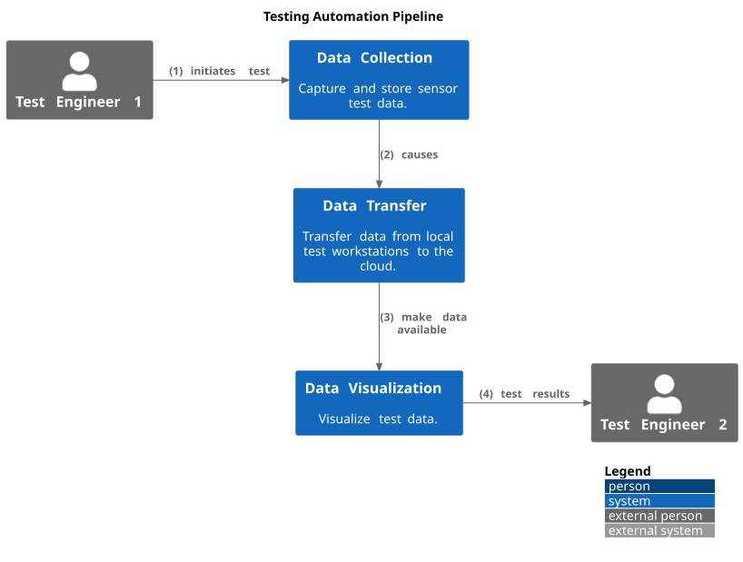
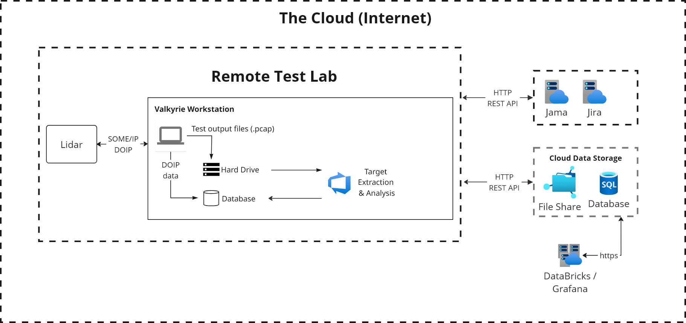
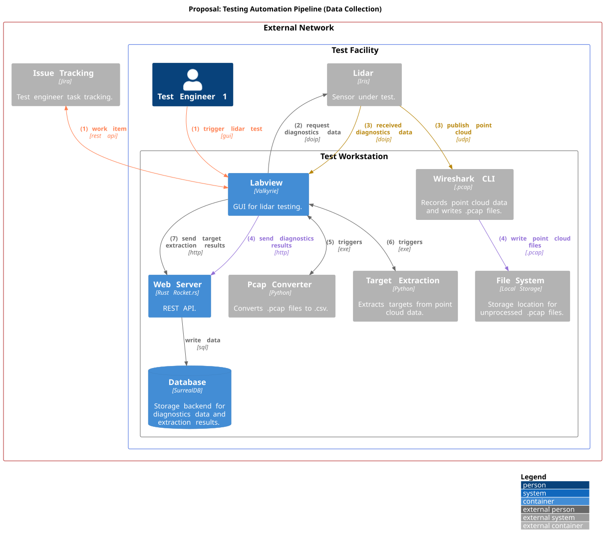
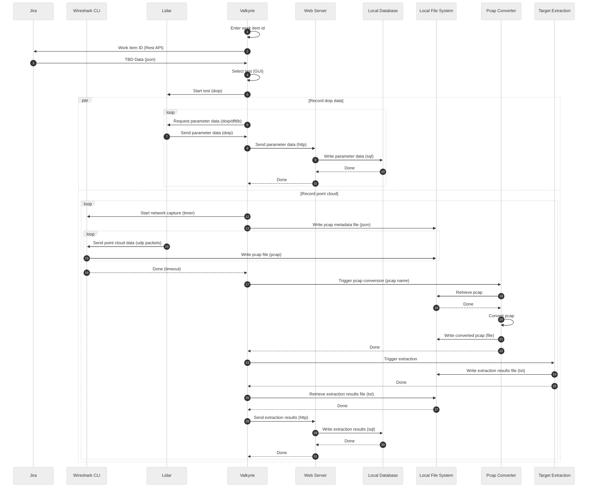
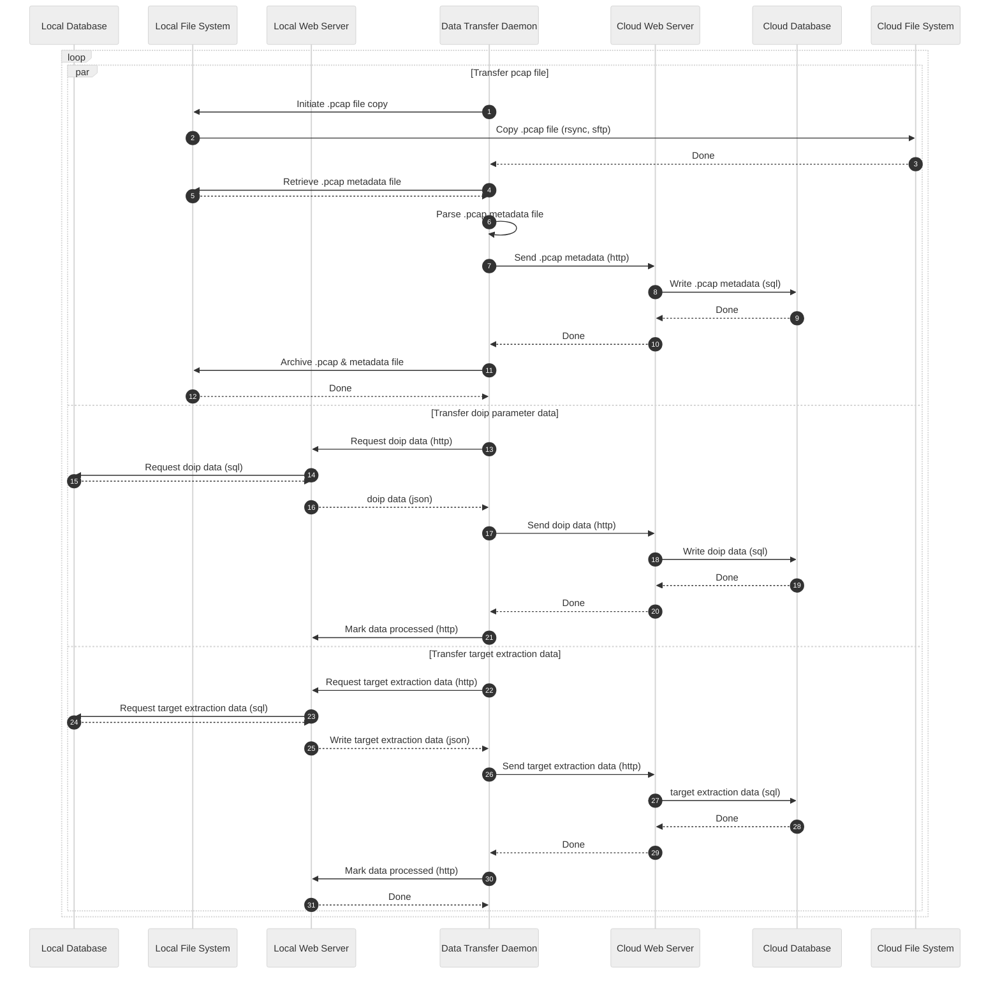
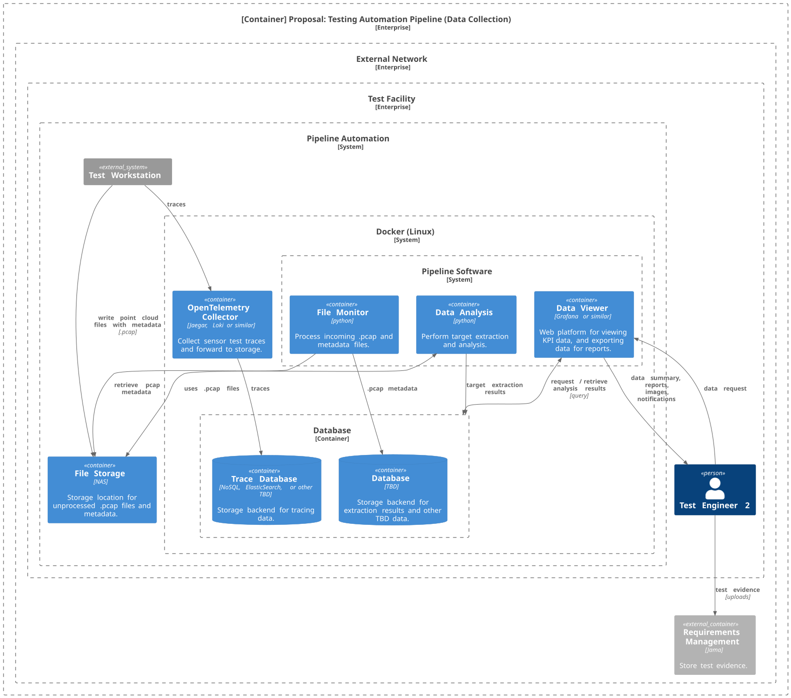
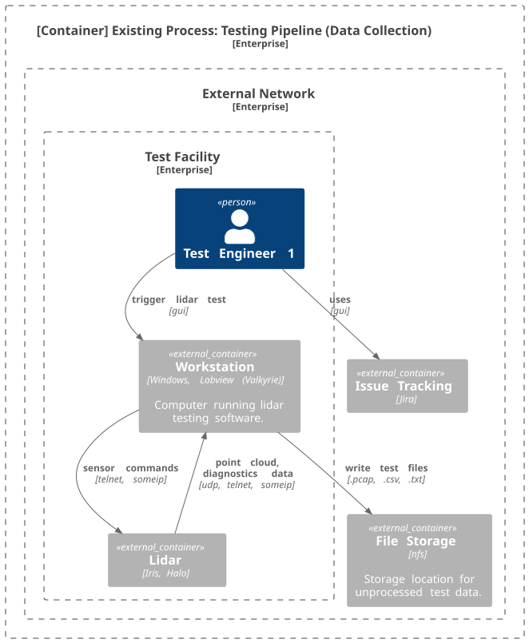
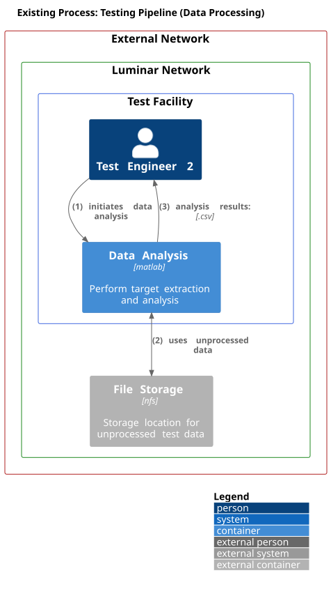

# Testing Automation Pipeline System Design

Last Updated: 2024-mm-dd

## Table of Contents

<!-- mdformat-toc start --slug=github --no-anchors --maxlevel=6 --minlevel=2 -->

- [Table of Contents](#table-of-contents)
- [Document Notes](#document-notes)
- [Overview](#overview)
- [Context](#context)
- [Goals](#goals)
- [Non-Goals](#non-goals)
- [Milestones](#milestones)
- [Proposed Solution](#proposed-solution)
  - [System Overview](#system-overview)
  - [Proposed Data Collection](#proposed-data-collection)
  - [Proposed Data Collection Entities](#proposed-data-collection-entities)
    - [Jira](#jira)
    - [Wireshark CLI](#wireshark-cli)
    - [Lidar](#lidar)
    - [Valkyrie](#valkyrie)
    - [Local Web Server](#local-web-server)
    - [Local Database](#local-database)
    - [Local File System](#local-file-system)
    - [Pcap Converter](#pcap-converter)
    - [Target Extraction](#target-extraction)
  - [Proposed Data Transfer](#proposed-data-transfer)
  - [Proposed Data Transfer Entities](#proposed-data-transfer-entities)
    - [Data Transfer Daemon](#data-transfer-daemon)
  - [Additional Software](#additional-software)
    - [DoIP Diagnostics and Flashing](#doip-diagnostics-and-flashing)
    - [SOME/IP](#someip)
    - [Front End](#front-end)
- [Existing Solution](#existing-solution)
  - [Existing Data Collection](#existing-data-collection)
  - [Existing Data Processing](#existing-data-processing)
  - [Existing Entities](#existing-entities)
    - [Jira (Existing)](#jira-existing)
    - [Target Extraction (Existing)](#target-extraction-existing)
    - [Lidar (Existing)](#lidar-existing)
    - [NFS File Storage (Existing)](#nfs-file-storage-existing)
    - [Valkyrie Workstation (Existing)](#valkyrie-workstation-existing)
      - [PCAP Naming Convention](#pcap-naming-convention)
- [Alternative Solutions](#alternative-solutions)
- [Cross-Team Impact](#cross-team-impact)
- [Open Questions](#open-questions)
- [Detailed Scoping and Timeline](#detailed-scoping-and-timeline)

<!-- mdformat-toc end -->

<!-- 
Document template taken from:
https://www.freecodecamp.org/news/how-to-write-a-good-software-design-document-66fcf019569c/
-->

## Document Notes

The software architecture diagrams in this document use the [C4 model](https://c4model.com/).
See [here](https://youtu.be/x2-rSnhpw0g) for a brief tutorial.

## Overview

<!--
A high level summary that every engineer at the company should understand and use to decide if it's useful for them to read the rest of the doc. It should be 3 paragraphs max.
-->

An integral step in the manufacturing of lidar is ensuring they perform to the system requirements.
While each sensor at a manufacturing facility undergoes a series of tests before leaving that facility, it's necessary to perform more robust testing to ensure no sensor performance degredation occurs over time.
This extra step, referred to as parameter testing (and monitoring), involves adjusting inputs to the sensor within certain boundaries.
The goal is to observe the sensor's output and confirm it operates as anticipated under the varied conditions.

The System Test Team is responsible for performing these additional tests on select sensors.
Note that there are different levels of parameter testing.
These can range from comprehensive testing that covers system-level requirements, to more limited testing that focuses on a subset of these parameters, or even continuous monitoring of certain intrinsic parameters during operation.

The 3 different type of parameter test defintions for Iris and Iris+ is shown in the table below.

|                                     Iris (VCC) Test ID                                     | Description for Iris | Iris+ (MB) Test ID |   Description for Iris+ | Luminar Test ID |             Luminar Description              |
| :----------------------------------------------------------------------------------------: | :------------------: | :----------------: | ----------------------: | :-------------: | :------------------------------------------: |
| [FT1](https://luminar.jamacloud.com/perspective.req#/testPlans/2252407/home/?projectId=87) |  Functional Test 1   |        P02         | Parameter Testing Small |       FPT       |    Functional Parameter Testing (Limited)    |
| [FT2](https://luminar.jamacloud.com/perspective.req#/testPlans/1824961/home/?projectId=87) |  Functional Test 2   |        P03         | Parameter Testing Large |       APT       | Acceptance Parameter Testing (Comprehensive) |
| [FT3](https://luminar.jamacloud.com/perspective.req#/testPlans/2319205/home/?projectId=87) |  Functional Test 3   |        P01         |   Continuous Monitoring |       CPM       |       Continuous Parameter Monitoring        |

While the exact specifications of these tests are outside the scope of this document (though details can be found [here](https://luminartech.sharepoint.com/:p:/s/SharedFiles/EQHOJNqx7GxIuGgJ0OetWdwBdkQNoR8Q46KQb3aKOsfmQg?e=C4qzhl))
the testing process, how test engineers collect data, and how that process can be automated is the focus of this design.

**It is important to note that this automated process is required as part of the transition of manufacturing to TPK in 2025/2026.**

## Context

<!-- 
A description of the problem at hand, why this project is necessary, what people need to know to assess this project, and how it fits into the technical strategy, product strategy, or the team's quarterly goals.
-->

This document describes the current [FT process](https://luminartech.sharepoint.com/:p:/s/SharedFiles/EQHOJNqx7GxIuGgJ0OetWdwBdkQNoR8Q46KQb3aKOsfmQg?e=C4qzhl) as performed in Orlando, as well as the proposed automation required for transitioning the testing to TPK.

The current FT process is a mostly manual process with a few automation steps built in for convenience.
It primarily consists of a series of steps requiring users to input file names, copy files to various locations, trigger data analysis for specific test runs, and extract and manipulate data from .csv files to produce reports.
These steps are prone to user error which causes delays.
Perhaps more importantly though, the ability to view the test data over time against KPIs is lacking.
This makes the trend analysis of sensor parameter testing not possible without investing an extradorinary amount of time.

## Goals

The proposed FT solution will:

- Be architectured in a flexible manner allows the eventual support of additional test processes, i.e., Iris+ (P01 - P03), and Halo.
- Minimize data entry for the test engineer at the workstation
- Minimize the need for the manual processing of test output data
- Replace telnet from the test process with DOIP and SOME/IP
- Store sensor test output in a commonly accessible and searchable format
- Port the existing Matlab target extraction code to Python
- Automatically trigger target extraction and generate results and KPI data
- Store target extraction results in a commonly accessible and searchable format
- Reduce the time required for analysis and report creation
- Provide cloud based dashboards for viewing data against KPIs
- Report errors that occur during the testing process
- Generate test evidence that can be saved in Jama for auditing purposes
- Provide a process to install the software solution on local workstations and cloud server(s)
- Data security and export considerations with regards to foreign entities

<!--
The Goals section should:

    - describe the user-driven impact of your project — where your user might be another engineering team or even another technical system
    - specify how to measure success using metrics — bonus points if you can link to a dashboard that tracks those metrics
-->

## Non-Goals

<!--
Non-Goals are equally important to describe which problems you won't be fixing so everyone is on the same page.
-->

The proposed solution will intentionally **NOT** address:

- Fully automating FT testing. A test engineer will still be required.
- Changing the existing FT process for use in Orlando before deployment to TPK.
- Integrating the FT test data with the CMX manufacturing test data.
- Adding any tests outside the current FT testing.

## Milestones

<!-- 
A list of measurable checkpoints, so your PM and your manager's manager can skim it and know roughly when different parts of the project will be done. I encourage you to break the project down into major user-facing milestones if the project is more than 1 month long.

Use calendar dates so you take into account unrelated delays, vacations, meetings, and so on. It should look something like this:

Start Date: June 7, 2018
Milestone 1 — New system MVP running in dark-mode: June 28, 2018
Milestone 2 - Retire old system: July 4th, 2018
End Date: Add feature X, Y, Z to new system: July 14th, 2018

Add an [Update] subsection here if the ETA of some of these milestone changes, so the stakeholders can easily see the most up-to-date estimates.
-->

Data Collection

- Database
  - Database selected and deployed
  - Local database schemas designed (basic)
  - Local database schema designed (full)
  - Deployment strategy
- Web Server
  - Software selected, installed, and configured
  - Rest API defined
    - Data collection
    - Data transfer
  - Web requests CRUD database
  - Simulate input data
  - Deployment strategy
- Valkyrie
  - Read sensor via doip
  - Use SOME/IP instead of telnet
  - Telnet replaced with DFTlib & SOME/IP
  - Store doip data in database via webserver
  - Triggers PCAP conversion
  - Triggers target extraction
  - Store target extraction data in database via webserver
- Target extraction
  - Scenes ported from Matlab to Python
  - KPIs written to test files
  - Deployment strategy

Data Transfer

- Cloud Environment
  - IT infrastructure approved
  - Cloud provider selected
  - Cloud database selected and configured
  - Cloud storage selected and configured
- Data Transfer Daemon
  - Transfer PCAP files
    - Store PCAP metadata in cloud database via webserver
    - Archive local PCAP & metadata
  - Transfer Doip parameter data
  - Transfer target extraction data
  - Deployment strategy

Data KPI Visualization

- Web frontend solution evaluated
- Web frontend solution selected and deployed

## Proposed Solution

### System Overview

The proposed system level diagram of the FT automation testing is shown in the diagram below.




[Cloud Architecture](https://miro.com/app/board/uXjVLfW5w_k=/)

### Proposed Data Collection

The proposed data collection process for the FT automation testing is shown in the container and sequence diagrams below.





### Proposed Data Collection Entities

#### Jira

Jira is currently used to track testing tasks.
The existing structure is incompatible for use to update automatically.

**TODO:**

- Decide upon a new Jira structure that will allow for automated updates via REST API.
- Integrate Valkyrie with REST API
  - User can input ticket number and Valkyrie will update the ticket

#### Wireshark CLI

Open source software.
Currently used by Valkyrie to collect pcaps during some tests.
It will continue to be used.

Pcaps are currently written with metadata in the file name.
Since this data is hard to parse, a .json metadata file will be written that maps to the pcap filename.

Example file data:

```json
"scene": "Ricky",      # string
"voltage": "14",       # float
"temperature C": "25", # float
"length": "00:45",     # duration mm:ss 
"line sync": "20",     # integer
"max azimuth": "0",    # float
"min azimuth": "-16",  # float
"scan pattern": "NameOfScanPattern.csv", # string
"laser power percentage": "100.00" # float
```

**TODO:**

- Figure out installation details on a test workstation.

#### Lidar

Iris, Iris+, or (future) Halo sensor.

Support will initially be for VCC Iris, with the limiting factor being DOIP support.
Telnet is currently used for collecting data and will be replaced by DFT (DOIP) and a SOME/IP implementation.
VSOME/IP can be used as a non ideal SOME/IP implementation.

#### Valkyrie

A **Windows** workstation running the Valkyrie (Labview) software.
(Labview is capable of running on Linux, but the target platform is Windows.)
Valykrie is a GUI that allows operators to select and run various tests for a sensor.
It is the process orchestrator that initiates all automated data collection, processing, and storage on a local workstation.

Valkyrie will be kept as part of the new process.

Repository: [SystemTestTools](https://github.com/luminartech/SystemTestTools)

POC: Jeff Hawkins

**TODO:**

- How is Valkyrie going to be deployed as part of the solution?

  - What is the current update process?

- Integrate Valkyrie with the Jira REST API so ticket numbers can be sourced and test completion results written.

  - [Possible solution](https://knowledge.ni.com/KnowledgeArticleDetails?id=kA00Z0000019VpgSAE&l=en-US).

#### Local Web Server

Rust webserver using the Rocket.rs web framework.
It provides a REST API for storing test results.

#### Local Database

[SurrealDB](https://surrealdb.com/) allows:

- Document and structured data tables
- File based data store
- Client / server data store
- Scalable storage suitable for local and cloud environments
- Surrealist web interface (SQL) for interrogating data.

Eventually, ODX files will be used to generate structured tables for each firmware version.
In this way a change in firmware diagnostics will automatically support removing and adding diagnostics fields.

**TODO:**

- Figure out initial database schema for MVP

#### Local File System

Hard drive of the Valkyrie workstation.
Each workstation will be used to store the pcaps and pcap metadata file.

**- Existing -**

Windows network share that stores the pcaps, telnet data, target extraction results, and all other test data.

#### Pcap Converter

Stand alone executable triggered by Valkyrie that converts a pcap to an xyz file.

Developed and maintained by Jeff Hawkins.

#### Target Extraction

Stand alone executable (python code) triggered by Valkyrie that performs target extraction and analysis of pcaps.
A test station targets a particular scene with each scene requiring its own algorithm.
2 scenes have been ported from Matlab to Python.
A third scene might be needed for TPK.

Analysis takes about 10 - 30 seconds depending on pcap length. Output is a text file.

Software is developed and maintained by Daniel Ferrone.

### Proposed Data Transfer

The diagram below shows the proposed solution for transferring local test data to the cloud (or alternate datastore).



<!--  -->

### Proposed Data Transfer Entities

The local and web instances of the database, file system, and web server are the same. They are described in the [Proposed Data Collection Entities Section](#proposed-data-collection-entities)

#### Data Transfer Daemon

Python application running on the test workstation.
It periodically transfers pcaps and test data from the local test workstation to the cloud.

### Additional Software

Several additional pieces of software are required to meet the requirements of the automation effort.

#### DoIP Diagnostics and Flashing

A library and command line tool for issuing diagnostics commands to a Luminar sensor.
It partially replaces telnet and allows parameters to be read from the sensor via DOIP.
Valkyrie will consume this as a shared .dll.

Repository: [DFT](https://github.com/luminartech/dft)

POC: Zach Heylmun

#### SOME/IP

In order to replace telnet, DoIP and SOME/IP are both required.
An implementation of SOME/IP is currently being worked on by Zach Heylmun.
VSOMEIP is possible to use but work is required to make it usable in tests.

#### Front End

GUI allowing for two disparate activities.

1. View KPI data and export graphs
1. View / administer(?) the system status

- Grafana
- Power BI
- Databricks (cloud only)

**- Outstanding Questions**

- What data is currently being exported for graphs and diagrams today?

<!-- End entities ----------------------------------------------------------------------------------------------------->

## Existing Solution

### Existing Data Collection

The existing data collection process for the FT2 testing is shown in the diagram below.



### Existing Data Processing

The existing data processing process for the FT2 testing is shown in the diagram below.



<!-- 
In addition to describing the current implementation, you should also walk through a high level example flow to illustrate how users interact with this system and/or how data flow through it.

A user story is a great way to frame this. Keep in mind that your system might have different types of users with different use cases.
-->

### Existing Entities

#### Jira (Existing)

Jira is used to track test results in an unorganized fashion.

An epic is used to track a batch of sensor to test, e.g. [Iris Slim V1 - PV (70-0025007/008)](https://luminartech.atlassian.net/browse/TV-5628)

Stories are used to group tasks in an adhoc manner, e.g. [PV: Leg1 ReTest_PV1-002753](https://luminartech.atlassian.net/browse/TV-8426)

Tasks (not currently linked to epics) are used to track a certain type of test result for multiple sensors.
A single sensor's test completion is tracked as a comment, e.g. [PV Retest Leg 1 FT1 Data Collection - Post FW Update](https://luminartech.atlassian.net/browse/TV-8763)

#### Target Extraction (Existing)

The data analysis is performed by a Matlab application which performs target extraction on the test pcaps.

Repository: [IrisDataTools](https://github.com/luminartech/IrisDataTools)

POC: Daniel Ferrone

**- Outstanding Questions**

- How can I run target extraction manually on a single pcap file?
- What are the outputs, how many are there, and how are they used in reporting? (Mehdi Chaouqi)

#### Lidar (Existing)

The Iris sensor under test. Iris+ and Halo support are [out of scope](#context) for the initial FT2 design.

#### NFS File Storage (Existing)

\[External System\]

A common network file share (NFS) used to store output test data before it is processed.
It's a NAS that is accessible from all workstations.

The current base location for FT2 data is: `\\mco1-fs03\Workgroups\validation-data\`

Example output location: `Iris_Sensor_Head_70-0025-010\P32406697T00003188VAE7E3\`

```shell
Iris_Sensor_Head_XX-YYYY-ZZZ        - (XX-YYYY-ZZZ is the numeric sensor hardware pedigree) 
└── <Sensor Serial Number> 
    ├── FT2-Pre
    │   ├── Adams_YYYYMMDD_HHMM     - (near field station)
    │   ├── Eve_YYYYMMDD_HHMM       - (near field station)
    │   ├── Bishop_YYYYMMDD_HHMM    - (long range test facility)
    │   └── Skippy_YYYYMMDD_HHMM    - (long range test facility)
    └── FT2-Post
        └── <Same layout as FT2-Post>
```

#### Valkyrie Workstation (Existing)

A Windows workstation running the Valkyrie (Labview) software.
Valykrie is a GUI that allows operators to select and run various tests for a sensor.
The output of these tests, currently telnet .csv and point cloud .pcap captures, are stored on the NFS.

Valkyrie will be kept as part of the new process.

Repository: [SystemTestTools](https://github.com/luminartech/SystemTestTools)

POC: Jeff Hawkins

##### PCAP Naming Convention

PCAP files are automatically captured by [Valkyrie](#valkyrie-workstation-existing) at various points in the testing.
The output file name is based upon the test parameters. E.g. `282_200m_28fov_n4offs_n60_LO123_1_00002_20220428101251.pcap`

**- Outstanding Questions**

- The file names contain metadata that presumably is relevant to the data analysis phase.
  - Parsing these strings seems error prone and complicated.
    Can we write a pcap file with some basic identifiers in the name, but then store the metadata in a corresponding .csv or .json file?

<!--
Some people call this the Technical Architecture section. Again, try to walk through a user story to concretize this. Feel free to include many sub-sections and diagrams.

Provide a big picture first, then fill in lots of details. Aim for a world where you can write this, then take a vacation on some deserted island, and another engineer on the team can just read it and implement the solution as you described.
-->

## Alternative Solutions

<!--
What else did you consider when coming up with the solution above? What are the pros and cons of the alternatives? Have you considered buying a 3rd-party solution — or using an open source one — that solves this problem as opposed to building your own?
Testability, Monitoring and Alerting

I like including this section, because people often treat this as an afterthought or skip it all together, and it almost always comes back to bite them later when things break and they have no idea how or why.
-->

## Cross-Team Impact

<!--
- How will this increase on call and dev-ops burden?
- How much money will it cost?
- Does it cause any latency regression to the system?
- Does it expose any security vulnerabilities?
- What are some negative consequences and side effects?
- How might the support team communicate this to the customers?
-->

## Open Questions

<!--
Any open issues that you aren't sure about, contentious decisions that you'd like readers to weigh in on, suggested future work, and so on. A tongue-in-cheek name for this section is the “known unknowns”.
-->

## Detailed Scoping and Timeline

<!--
This section is mostly going to be read only by the engineers working on this project, their tech leads, and their managers. Hence this section is at the end of the doc.

Essentially, this is the breakdown of how and when you plan on executing each part of the project. There's a lot that goes into scoping accurately, so you can read this post to learn more about scoping.

I tend to also treat this section of the design doc as an ongoing project task tracker, so I update this whenever my scoping estimate changes. But that's more of a personal preference.
-->
