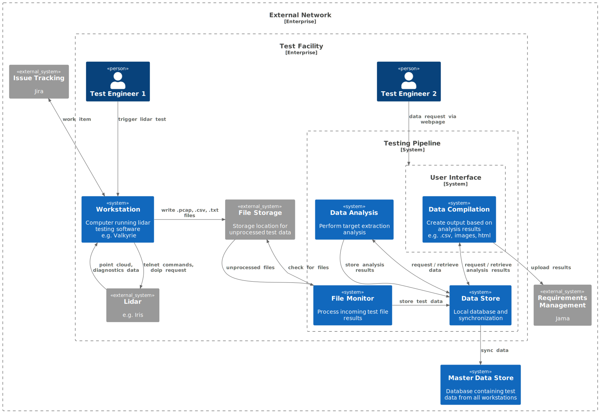

# Testing Automation Pipeline Software Architecture

## Table of Contents

<!-- mdformat-toc start --slug=github --no-anchors --maxlevel=6 --minlevel=2 -->

<!-- mdformat-toc end -->

## The Format

We are following the C4Model. This means we view the Context, Container, Components and Code.
For more information about it check out the video on the [C4 Model Website](https://c4model.com).

## Static Architecture

### System Context Diagram

