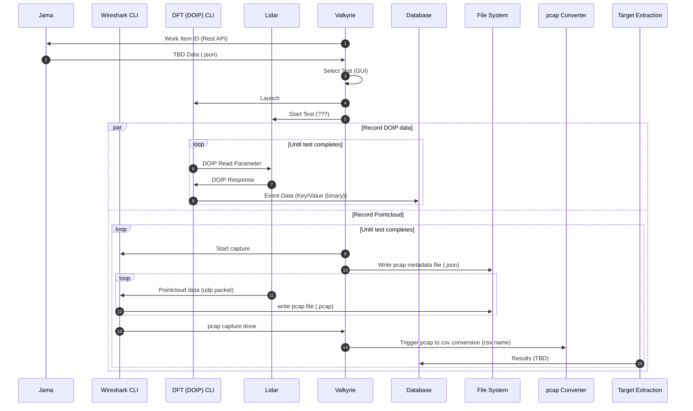

# Testing Automation Pipeline Software Architecture

## Table of Contents

<!-- mdformat-toc start --slug=github --no-anchors --maxlevel=6 --minlevel=2 -->

- [Table of Contents](#table-of-contents)
- [The Format](#the-format)
- [Static Architecture](#static-architecture)
  - [System Overview](#system-overview)
  - [Sequence Diagram](#sequence-diagram)

<!-- mdformat-toc end -->

## The Format

We are following the C4Model. This means we view the Context, Container, Components and Code.
For more information about it check out the video on the [C4 Model Website](https://c4model.com).

## Static Architecture

### System Overview

<!--
The proposed system level diagram the FT2 automation testing is shown in the diagram below.

### Proposed Data Collection

The proposed data collection process for the FT2 automation testing is shown in the diagram below.

### Proposed Data Processing

The proposed data processing for the FT2 automation testing is shown in the diagram below.

-->

### Sequence Diagram

