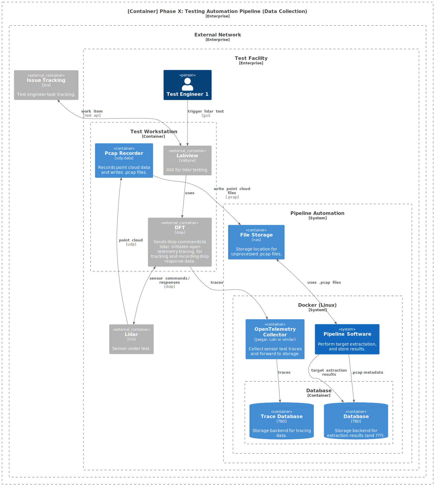

# Testing Automation Pipeline System Design

Last Updated: 2024-mm-dd

## Table of Contents

<!-- mdformat-toc start --slug=github --no-anchors --maxlevel=6 --minlevel=2 -->

- [Table of Contents](#table-of-contents)
- [Overview](#overview)
- [Context](#context)
- [Goals and Non-Goals](#goals-and-non-goals)
- [Milestones](#milestones)
- [Existing Solution](#existing-solution)
  - [Existing Entities](#existing-entities)
    - [Jira](#jira)
    - [Valkyrie Workstation](#valkyrie-workstation)
      - [PCAP Naming Convention](#pcap-naming-convention)
    - [NFS File Storage](#nfs-file-storage)
    - [Lidar](#lidar)
    - [Data Analysis (Matlab)](#data-analysis-matlab)
  - [Existing Data Collection](#existing-data-collection)
  - [Existing Data Processing](#existing-data-processing)
- [Proposed Solution](#proposed-solution)
  - [Proposed Entities](#proposed-entities)
    - [Jira (Existing)](#jira-existing)
    - [Valkyrie Workstation (Existing)](#valkyrie-workstation-existing)
    - [Pcap Recorder (Replacement)](#pcap-recorder-replacement)
    - [NFS File Storage (Existing)](#nfs-file-storage-existing)
    - [DFT](#dft)
    - [OpenTelemetry Collector](#opentelemetry-collector)
  - [System Overview](#system-overview)
  - [Proposed Data Collection](#proposed-data-collection)
  - [Proposed Data Processing](#proposed-data-processing)
- [Alternative Solutions](#alternative-solutions)
- [Cross-Team Impact](#cross-team-impact)
- [Open Questions](#open-questions)
- [Detailed Scoping and Timeline](#detailed-scoping-and-timeline)

<!-- mdformat-toc end -->

<!-- https://www.freecodecamp.org/news/how-to-write-a-good-software-design-document-66fcf019569c/ -->

## Overview

<!--
A high level summary that every engineer at the company should understand and use to decide if it's useful for them to read the rest of the doc. It should be 3 paragraphs max.
-->

An integral step in the manufacturing of lidar is ensuring they perform to the system requirements.
While each sensor at a manufacturing facility undergoes a series of tests before leaving that facility, it's necessary to perform more robust testing to ensure no sensor performance degredation occurs over time.
This extra step, referred to as parameter testing (and monitoring), involves adjusting inputs to the sensor within certain boundaries.
The goal is to observe the sensor's output and confirm it operates as anticipated under the varied conditions.

The System Test Team is responsible for performing these additional tests on select batches of sensors.
Note that there are different levels of parameter testing.
These can range from comprehensive testing that covers system-level requirements, to more limited testing that focuses on a subset of these parameters, or even continuous monitoring of certain intrinsic parameters during operation.

The 3 different type of parameter test defintions for Iris and Iris+ is shown in the table below.

|                                     Iris (VCC) Test ID                                     | Description for Iris | Iris+ (MB) Test ID |   Description for Iris+ | Luminar Test ID |             Luminar Description              |
| :----------------------------------------------------------------------------------------: | :------------------: | :----------------: | ----------------------: | :-------------: | :------------------------------------------: |
| [FT1](https://luminar.jamacloud.com/perspective.req#/testPlans/2252407/home/?projectId=87) |  Functional Test 1   |        P02         | Parameter Testing Small |       FPT       |    Functional Parameter Testing (Limited)    |
| [FT2](https://luminar.jamacloud.com/perspective.req#/testPlans/1824961/home/?projectId=87) |  Functional Test 2   |        P03         | Parameter Testing Large |       APT       | Acceptance Parameter Testing (Comprehensive) |
| [FT3](https://luminar.jamacloud.com/perspective.req#/testPlans/2319205/home/?projectId=87) |  Functional Test 3   |        P01         |   Continuous Monitoring |       CPM       |       Continuous Parameter Monitoring        |

While the exact specifications of these tests are outside the scope of this document (though details can be found [here](https://luminartech.sharepoint.com/:p:/s/SharedFiles/EQHOJNqx7GxIuGgJ0OetWdwBdkQNoR8Q46KQb3aKOsfmQg?e=C4qzhl))
the testing process, how test engineers collect data, and how that process can be automated is the focus of this design.

## Context

<!-- 
A description of the problem at hand, why this project is necessary, what people need to know to assess this project, and how it fits into the technical strategy, product strategy, or the team's quarterly goals.
-->

This document describes the current [FT2 process](https://luminartech.sharepoint.com/:p:/s/SharedFiles/EQHOJNqx7GxIuGgJ0OetWdwBdkQNoR8Q46KQb3aKOsfmQg?e=C4qzhl) as well as the proposed automation for parts of this process.
The complete automation of the FT2 process is outside the scope of this design, and a test engineer will still be required.

It is understood that the FT2 automation process needs to be architectured in a manner that will allow the eventual support of additional test processes, i.e., FT1 and FT3 as well as Iris+ (P01 - P03), and Halo.
However, for the purposes of this design, those additional test processes are considered out of scope.

The System Test Team has automated several of the individual steps required for FT2 testing.
These individual automation steps have allowed the team to put together their current semi-automated process.

The current FT2 process relies upon a series of steps requiring users to input file names, copy files to various locations, trigger data analysis, and extract and manipulate data from .csv files to produce reports.
All of these steps are prone to user error which causes delays.
Perhaps more importantly though, the ability to view the test data over time against KPIs as well as interogating the report analysis is lacking. This makes trend analysis of sensor issues not possible without investing an extradorinary amount of time.

The proposed software solution is to

## Goals and Non-Goals

The proposed FT2 automation steps will address:

- Test output files not being transfered
- Storing sensor test output in a commonly accessible and searchable way
- Automatic triggering of data analysis (target extraction)
- Storing target extraction results in a commonly accessible and searchable way
- Reducing the time required for analysis and report creation
- The lack of dashboards for viewing data against KPIs

<!--
The Goals section should:

    - describe the user-driven impact of your project — where your user might be another engineering team or even another technical system
    - specify how to measure success using metrics — bonus points if you can link to a dashboard that tracks those metrics

Non-Goals are equally important to describe which problems you won't be fixing so everyone is on the same page.
-->

## Milestones

<!-- 
A list of measurable checkpoints, so your PM and your manager's manager can skim it and know roughly when different parts of the project will be done. I encourage you to break the project down into major user-facing milestones if the project is more than 1 month long.

Use calendar dates so you take into account unrelated delays, vacations, meetings, and so on. It should look something like this:

Start Date: June 7, 2018
Milestone 1 — New system MVP running in dark-mode: June 28, 2018
Milestone 2 - Retire old system: July 4th, 2018
End Date: Add feature X, Y, Z to new system: July 14th, 2018

Add an [Update] subsection here if the ETA of some of these milestone changes, so the stakeholders can easily see the most up-to-date estimates.
-->

FTD open telemetry tracing complete
Distributed Tracing Solution (Jaeggar, Grafana Loki, etc) tested and choosen

- Corresponding database selected

## Existing Solution

<!-- 
In addition to describing the current implementation, you should also walk through a high level example flow to illustrate how users interact with this system and/or how data flow through it.

A user story is a great way to frame this. Keep in mind that your system might have different types of users with different use cases.
-->

### Existing Entities

#### Jira

A Jira board is used along with epics, stories, and tasks to track the current testing tasks.

An epic is used to track a batch of sensor to test, e.g. [Iris Slim V1- PV (70-0025007/008)](https://luminartech.atlassian.net/browse/TV-5628)

Stories are used to group tasks in an adhoc manner. E.g. [PV: Leg1 ReTest_PV1-002753](https://luminartech.atlassian.net/browse/TV-8426)

Tasks (not currently linked to epics) are used to track a certain type of test result for multiple sensors.
A single sensor's test completion is tracked as a comment. E.g. [PV Retest Leg 1 FT1 Data Collection - Post FW Update](https://luminartech.atlassian.net/browse/TV-8763)

**- Outstanding Questions**

#### Valkyrie Workstation

\[External System\]

A Windows workstation running the Valkyrie (Labview) software.
Valykrie is a GUI that allows operators to select and run various tests for a sensor.
The output of these tests, currently telnet .csv and point cloud .pcap captures, are stored on the NFS.

Valkyrie will be kept as part of the new process.

Repository: [SystemTestTools](https://github.com/luminartech/SystemTestTools)

POC: Jeff Hawkins

**- Outstanding Questions**

- How is Valkyrie going to be deployed as part of the solution?
  - What is the current update process?
- Can Valkyrie be integrated with the Jira REST API so ticket numbers can be sourced and test completion results written?
  - Seems like the answer is [yes](https://knowledge.ni.com/KnowledgeArticleDetails?id=kA00Z0000019VpgSAE&l=en-US), thought not sure on the level of effort.
- PCAP recording is currently done with Wireshark, is that going to be replaced with a homegrown app?
  - Is this in scope, and who will do this work?

##### PCAP Naming Convention

PCAP files are automatically captured by [Valkyrie](#valkyrie-workstation) at various points in the testing.
The output file name is based upon the test parameters. E.g. `282_200m_28fov_n4offs_n60_LO123_1_00002_20220428101251.pcap`

**- Outstanding Questions**

- The file names contain metadata that presumably is relevant to the data analysis phase.
  - Parsing these strings seems error prone and complicated.\\
    Can we write a pcap file with some basic identifiers in the name, but then store the metadata in a corresponding .csv or .json file?

#### NFS File Storage

\[External System\] -> \[Internal System\]

A common network file share (NFS) used to store output test data before it is processed.
It's a NAS that is accessible from all workstations.

The current base location for FT2 data is: `\\mco1-fs03\Workgroups\validation-data\`

Example output location: `Iris_Sensor_Head_70-0025-010\P32406697T00003188VAE7E3\`

```shell
Iris_Sensor_Head_XX-YYYY-ZZZ        - (XX-YYYY-ZZZ is the numeric sensor hardware pedigree) 
└── <Sensor Serial Number> 
    ├── FT2-Pre
    │   ├── Adams_YYYYMMDD_HHMM     - (near field station)
    │   ├── Eve_YYYYMMDD_HHMM       - (near field station)
    │   ├── Bishop_YYYYMMDD_HHMM    - (long range test facility)
    │   └── Skippy_YYYYMMDD_HHMM    - (long range test facility)
    └── FT2-Post
        └── <Same layout as FT2-Post>
```

#### Lidar

\[External System\]

The Iris, Iris+, or Halo (future) sensor under test.

#### Data Analysis (Matlab)

\[External System\]

The data analysis is performed by a Matlab application which performs target extraction on the test pcaps.

Repository: [IrisDataTools](https://github.com/luminartech/IrisDataTools)

POC: Daniel Ferrone

**- Outstanding Questions**

- How can I run target extraction manually on a single pcap file?
- What are the outputs, how many are there, and how are they used in reporting?

### Existing Data Collection

The existing data collection process for the FT2 testing is shown in the diagram below.


### Existing Data Processing

The existing data processing process for the FT2 testing is shown in the diagram below.


## Proposed Solution

### Proposed Entities

<!-- #### Jira

#### Valkyrie Workstation

##### PCAP Naming Convention

#### NFS File Storage

#### Lidar -->

#### Jira (Existing)

[Jira (Existing)](#jira)

#### Valkyrie Workstation (Existing)

[Valkyrie Workstation (Existing)](#valkyrie-workstation)

#### Pcap Recorder (Replacement)

\[External\]

This is a replacement for recording the .pcap test data with Wireshark.
It will still be executed by Valkyrie in some fashion.

The pcap file will no longer be written with metadata in the filename.

Instead the filename will be:

- Some combination of the name of the test run and a date timestamp.
- A metadata file name the same as above with a different extension.

**- Outstanding Questions**

- Does this just need to be a CLI tool?
- Use an existing python pcap library? PyPCAPKit
- Just use wireshark on commandline?

#### NFS File Storage (Existing)

\[Internal\]

[NFS File Storage (existing)](#nfs-file-storage)

The NAS will hold the PCAP files indefinitely.

**- Outstanding Questions**

- It's unclear where the NAS needs to exist in the entire solution.
- Could it host the databases and the Docker Container mount the?
- Is storing the pcaps necessary?
  - If so, what about archiving, storing, database storage path, etc.

#### DFT

#### OpenTelemetry Collector

### System Overview

The proposed system level diagram the FT2 testing is shown in the diagram below.


### Proposed Data Collection

The proposed data collection process for the FT2 testing is shown in the diagram below.



### Proposed Data Processing

<!--
The proposed data processing process for the FT2 testing is shown in the diagram below.


-->

<!--
Some people call this the Technical Architecture section. Again, try to walk through a user story to concretize this. Feel free to include many sub-sections and diagrams.

Provide a big picture first, then fill in lots of details. Aim for a world where you can write this, then take a vacation on some deserted island, and another engineer on the team can just read it and implement the solution as you described.
-->

## Alternative Solutions

<!--
What else did you consider when coming up with the solution above? What are the pros and cons of the alternatives? Have you considered buying a 3rd-party solution — or using an open source one — that solves this problem as opposed to building your own?
Testability, Monitoring and Alerting

I like including this section, because people often treat this as an afterthought or skip it all together, and it almost always comes back to bite them later when things break and they have no idea how or why.
-->

## Cross-Team Impact

<!--
- How will this increase on call and dev-ops burden?
- How much money will it cost?
- Does it cause any latency regression to the system?
- Does it expose any security vulnerabilities?
- What are some negative consequences and side effects?
- How might the support team communicate this to the customers?
-->

## Open Questions

<!--
Any open issues that you aren't sure about, contentious decisions that you'd like readers to weigh in on, suggested future work, and so on. A tongue-in-cheek name for this section is the “known unknowns”.
-->

- Is this project approved?
- How long and for what parts of the project am I committed?
- What's the desired start time for contractors?

## Detailed Scoping and Timeline

<!--
This section is mostly going to be read only by the engineers working on this project, their tech leads, and their managers. Hence this section is at the end of the doc.

Essentially, this is the breakdown of how and when you plan on executing each part of the project. There's a lot that goes into scoping accurately, so you can read this post to learn more about scoping.

I tend to also treat this section of the design doc as an ongoing project task tracker, so I update this whenever my scoping estimate changes. But that's more of a personal preference.
-->
