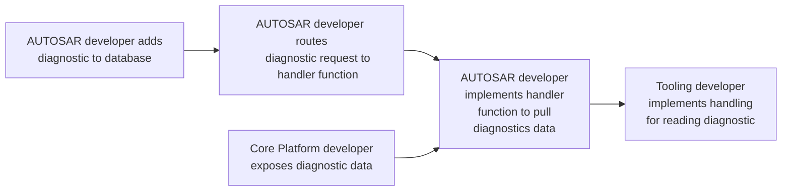
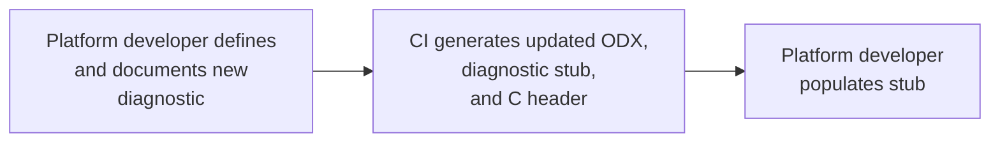

# Proposal for a new diagnostics definition paradigm across Luminar Sensors

Diagnostics across Luminar sensors share a tremendous amount of commonality,
but the current approach to diagnostics is fragmented and lacks a unified structure.
Adding new diagnostics currently involves coordinated effort from multiple teams,
and that work must be repeated for each variant of the sensor.
This proposal outlines a new paradigm for  that will unify diagnostics across all Luminar sensors,
making it much easier for firmware developers to add new diagnostics,
as well as automatically exposing and documenting those diagnostics through the DoIP interface and sensor tooling.

## Background

Luminar sensors provide diagnostics via DoIP, but the lack of readily available tooling,
and the challenging workflow required to define them has resulted in severely limited diagnostic capabilities.
Diagnostics are currently only available via Vector tools, which are expensive and require specialized training.
This has led to a situation where diagnostics are only available to a small subset of the organization,
and the knowledge of their use and and availability is extremely limited.
To work around this limitation, most internal diagnostics receive first class support in Telnet,
but not the actual diagnostics interface.
Additionally, diagnostics are not available to external customers, which limits the ability to provide support.
This limitation has significantly hampered the ability to diagnose issues in the field,
and represents a significant sales challenge.
Finally, because diagnostics are not available as a core platform feature,
customer programs have heavily fragmented the ecosystem and created lots of duplicated effor.

## Current Situation

Adding a new diagnostic to a sensor is a complex process that requires coordination between multiple teams.
The process is as follows:



Each of these discrete tasks is then repeated for every diagnostic,
for every version of the sensor.
There is a significant amount of code sharing within the firmware,
but it is done in an ad-hoc way with conditional compilation and multiple
programs working on the same shared files.
This results in considerable risk of unintended inter-program impacts,
and has also resulted in significant rework and duplication.

## Upcoming Work

The opportunity to align on a robust solution for developing,
documenting, and utilizing diagnostics has never been greater.

There are currently several fairly major critical upcoming activities based on DoIP diagnostics:

- Iris Generic Diagnostics brought to parity with VCC.
- Systems Test tooling for validation with diagnostics instead of telnet
- Predictive Failure analysis
- Iris Generic FBL
- Halo Generic FBL
- Halo Generic Diagnostics
- Halo VCC Diagnostics

In addition to the critical path activities listed above,
there are a number of less critical, but still valuable desires:

- Diagnostics support in Sentinel
- Diagnostics support in EnVision
- Customer facing diagnostics SDK

## Proposed Solution

In the current workflow, the format and content of the available data is duplicated in the core platform code,
AUTOSAR code, diagnostics database, and tooling.
The definition of diagnostics in the core platform code can instead drive the rest of the definitions.
The proposal is to use the framework laid by the existing diagnostics tooling
to produce a simple schema definition language.
Core platform developers would define the types available as diagnostics,
document them with comments, and then get the resulting ODX(Open Diagnostics Exchange)
and tooling definitions generated on CI.
We can also configure the automatic import of the ODX within the AUTOSAR tools,
automatically creating the appropriate handler callbacks.
This allows a single developer to add a diagnostic to the platform,
as well as make it available via the diagnostics over IP interface.
Additionally the approach of automatically generating ODX can be utilized to
immediately expose the new diagnostic in tools,
eliminating significant cost and effort on the testing and verification side.



## Downstream Benefits

By defining our own simple DSL for diagnostics,
we can unify the workflow for firmware developers, test developers,
and documentation generation.
This does not require a large amount of development,
as open source tooling already offers the capabilities being discussed here.
The work involved will simply be tailoring existing capabilities
to improve the current developer experience.
Additionally, having a single schema definition ensures that the diagnostics
interface is always in sync with the tooling and documentation.
This will allow use a common set of tools for most if not all of these upcoming projects,
and significantly ease development across all of them.

## Proposal Details

The definition of the DIDs and DTCs,
along with their documentation would be written in the Rust programming language.
This would not require firmware developers to learn Rust,
as it would only be used to define the structure of the available data.
In the context, it would look almost exactly like C,
just with some additional annotations and structured comments.
The much stronger type data available in Rust allow for deep introspection and enable
supporting non-trivial types in a consistent way.
This means that complex data types can be conveyed accurately complete with documentation between
the weakly typed C code and ODX used by Vector tooling.
There is also tooling which supports associating documentation comments with the structs and fields,
and this can be carried over to the generated ODX definitions and C header files.
The tooling can trivially be made available on all platforms for developers.
The tooling also does not have any safety implications/requirements,
because the workflow of generating the C headers and ODX allows for those to be reviewed directly,
before integration.

### Sample Definition in Rust

```Rust

/// Enum representing the current state of `Thing`
enum ThingState {
    /// `Thing` has not yet been initialized
    Uninitialized,
    /// `Thing` has been initialized, and is in a normal state
    Initialized,
    /// `Thing` has encountered an error
    Error,
}

/// DID 0 is used to monitor a `Thing` that has a couple of relevant temperatures and has a state
struct ThingStatus {
    /// Relevant temperature 0 value in degrees celsius
    f32 temp_0;
    /// Relevant temperature 1 value in degrees celsius
    f32 temp_1;
    /// counter value, wraps at 2^32
    ThingState state;
}
```

### Resulting Definition in C header

```c
// Enum representing the current state of `Thing`
enum thing_state {
    // `Thing` has not yet been initialized
    uninitialized,
    // `Thing` has been initialized, and is in a normal state
    initialized,
    // `Thing` has encountered an error
    error,
}

// DID 0 is used to monitor a thing that has a couple of relevant temperatures and
struct did_0 
{   
    // Relevant temperature 0 value in degrees celsius
    float temp_0;
    // Relevant temperature 1 value in degrees celsius
    float temp_1;
    // How many time
    enum  thing_state state;
};
```

While this is a deliberately simple contrived example,
it's easy to see how the lack of strong typing in C makes even simple types like
Binary Coded Decimal strings ambiguous at the ODX level.
In C, BCD would be encoded as a simple byte array,
and the semantics of the data are not carried along with the definition.
